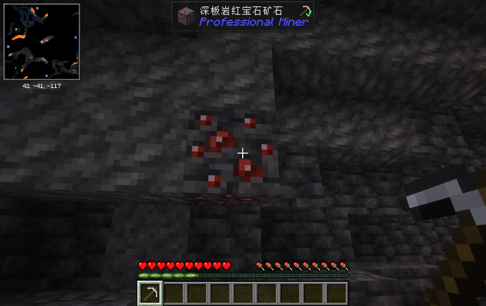
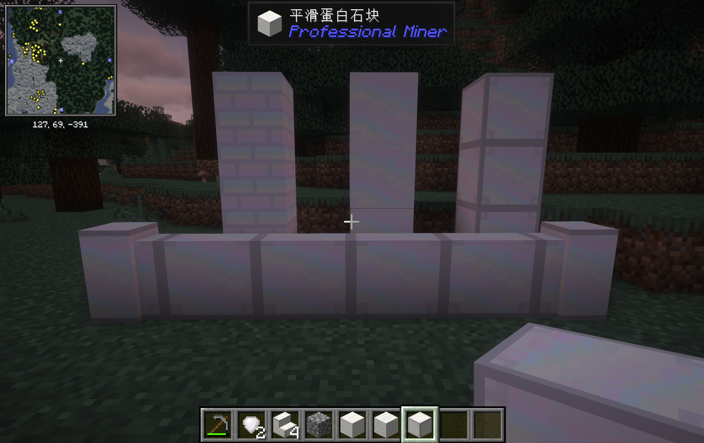
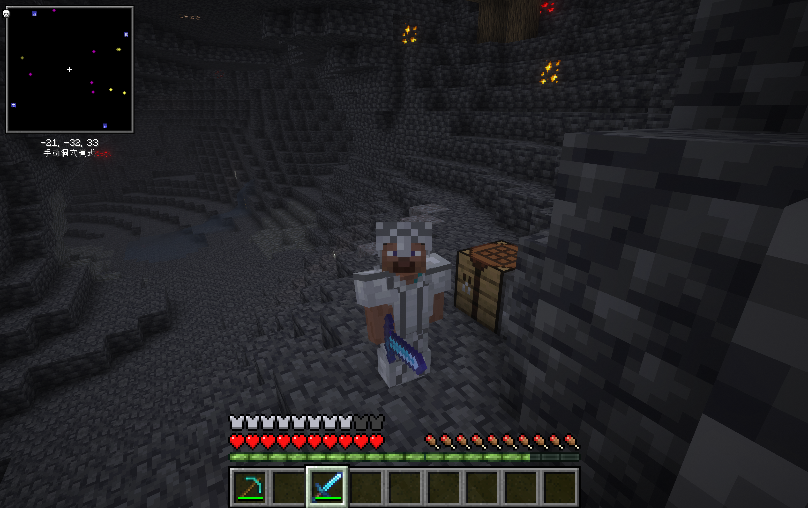

# Professional Miner

[🌐 中文版](README.md)

A mod focused on various minerals.
Supports Minecraft 1.21.1

---

## 📦 New Items Overview

### 💎 [Ruby Series](docs/ruby_en.md)

A rare mineral that generates deep underground (Y = -59 ~ -10). Mine Ruby Ore to obtain Rubies, and craft 6 Rubies into a Ruby Heart — using it permanently increases your max health by 1 heart.

> Includes: Ruby Ore, Deepslate Ruby Ore, Ruby, Ruby Heart
>
> 👉 [View Details](docs/ruby_en.md)

---

### 🤍 [Opal Series](docs/opal_en.md)

A gorgeous decorative material similar to quartz, with a milky white appearance and elegant patterns. Generates at mid-level underground (Y = -40 ~ 40) with abundant veins, and can be processed into various building blocks.

> Includes: Opal Ore, Opal, Opal Block, Smooth Opal Block, Opal Bricks, Opal Stairs, Opal Slab, Opal Pressure Plate, Opal Wall
>
> 👉 [View Details](docs/opal_en.md)

---

### ⚙️ [Titanium Series](docs/titanium_en.md)

A rare deep-level mineral that generates underground (Y = -50 ~ -15). Mine Titanium Ore to obtain Raw Titanium, smelt it into Titanium, then craft Titanium Alloy Ingots and Nether Titanium Alloy Ingots at a Smithing Table to create two sets of powerful armor.

> Includes: Titanium Ore, Deepslate Titanium Ore, Raw Titanium, Titanium, Alloy Smithing Template, Titanium Alloy Ingot, Titanium Alloy Block, Nether Titanium Alloy Ingot, Nether Titanium Alloy Block, Titanium Alloy Helmet/Chestplate/Leggings/Boots, Nether Titanium Alloy Helmet/Chestplate/Leggings/Boots
>
> 👉 [View Details](docs/titanium_en.md)

---

## 🎨 Creative Mode

All items can be found in the following Creative Mode tabs:
- **Building Blocks**: Opal Ore, Opal Block, Smooth Opal Block, Opal Bricks, Opal Stairs, Opal Slab, Opal Pressure Plate, Opal Wall, Ruby Ore, Deepslate Ruby Ore, Titanium Ore, Deepslate Titanium Ore, Titanium Alloy Block, Nether Titanium Alloy Block
- **Materials**: Ruby, Ruby Heart, Opal, Raw Titanium, Titanium, Alloy Smithing Template, Titanium Alloy Ingot, Nether Titanium Alloy Ingot
- **Combat**: Titanium Alloy Helmet/Chestplate/Leggings/Boots, Nether Titanium Alloy Helmet/Chestplate/Leggings/Boots
- **Professional Miner Tab**: Contains all items

---

## 🔧 Technical Information

| Property | Value |
|---|---|
| Mod ID | `profminer` |
| Mod Name | Professional Miner |
| Minecraft Version | 1.21.1 |
| Mod Loader | NeoForge 21.1.219 |
| Author | KylinHuang & dragonhahaha |
