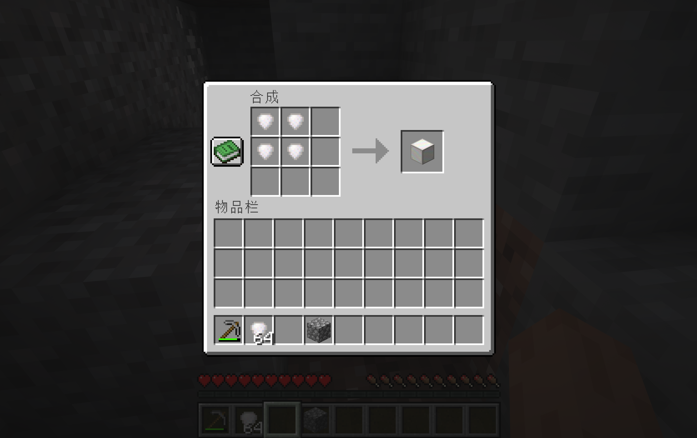
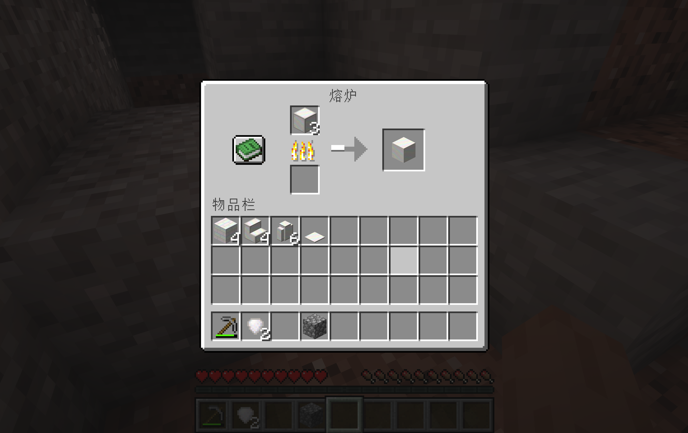
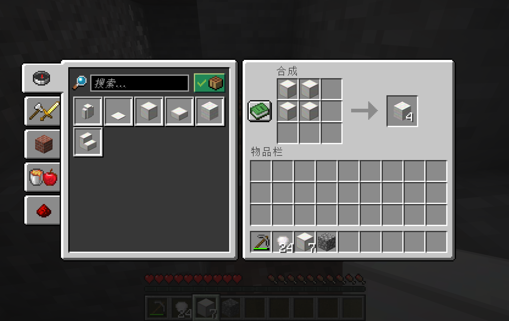
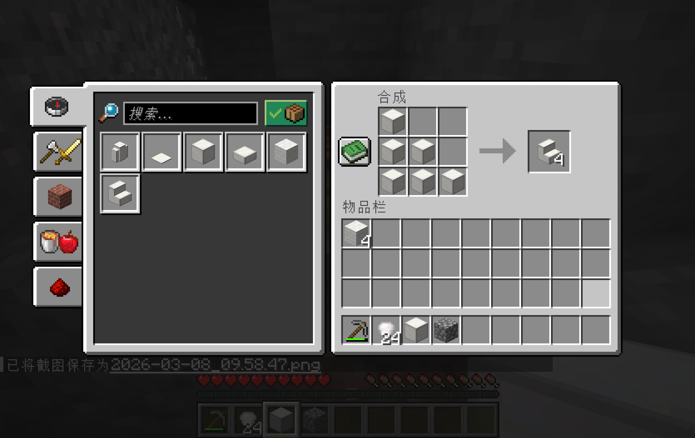
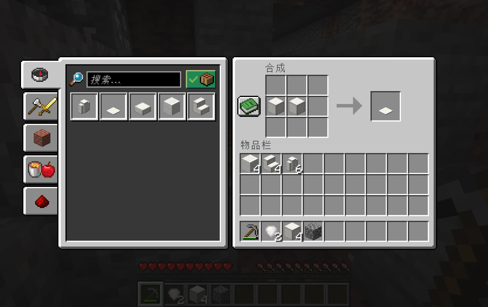
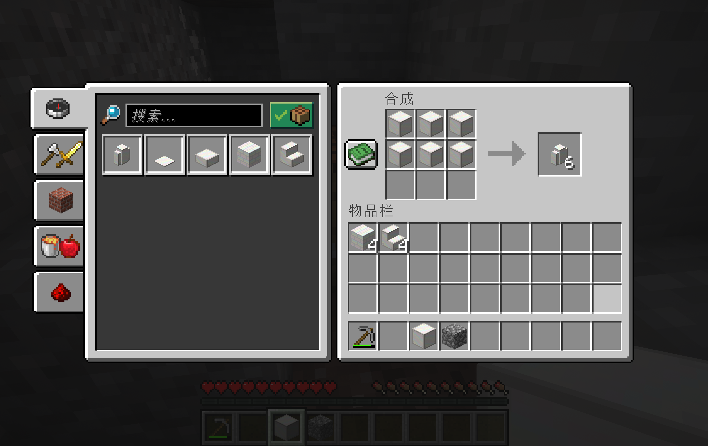

# 🤍 蛋白石系列

蛋白石是一种类似石英的华丽装饰材料，外观呈乳白色并带有优雅花纹。

## 蛋白石矿石（Opal Ore）

- **生成范围**：Y = -40 ~ 40，均匀分布
- **矿脉大小**：每个矿脉最多 32 个方块，每区块 5 次
- **挖掘要求**：石镐及以上
- **掉落**：3~6 个蛋白石（支持时运附魔，精准采集掉落矿石本身）
- **不掉落经验**

## 蛋白石（Opal）

- 蛋白石矿石的掉落物，用于合成蛋白石块

## 蛋白石块（Opal Block）

- **合成配方**：
  

- 基础装饰方块，可进一步合成其他建筑方块

## 平滑蛋白石块（Smooth Opal Block）

- **获取方式**：将蛋白石块放入熔炉烧制

- 表面更加光滑平整的变体

## 蛋白石砖（Opal Bricks）
- **合成配方**：

- 带有更丰富花纹的砖块变体

## 蛋白石楼梯（Opal Stairs）
- **合成配方**：标准楼梯配方（使用蛋白石块）

## 蛋白石台阶（Opal Slab）
- **合成配方**：标准台阶配方（使用蛋白石块）

## 蛋白石压力板（Opal Pressure Plate）
- **合成配方**：标准压力板配方（使用蛋白石块）

## 蛋白石围墙（Opal Wall）
- **合成配方**：标准围墙配方（使用蛋白石块）

- 可与原版围墙（如原石围墙等）正常连接