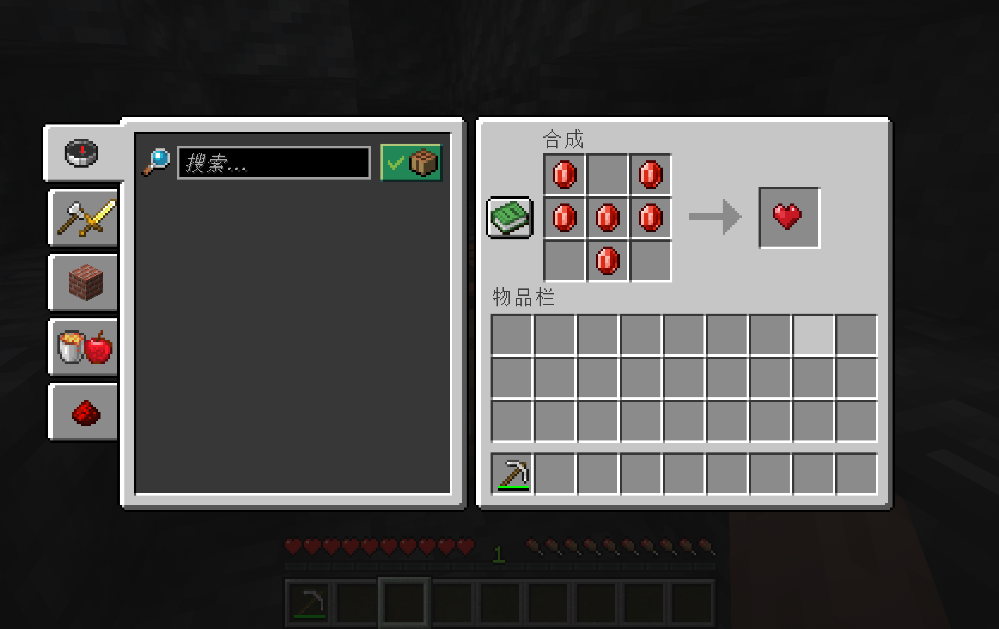

# 💎 红宝石系列

## 红宝石矿石（Ruby Ore）

- **生成范围**：Y = -59 ~ -10，均匀分布
- **矿脉大小**：每个矿脉最多 4 个方块，每区块 1 次
- **挖掘要求**：铁镐及以上
- **掉落**：红宝石（支持时运附魔，精准采集掉落矿石本身）
- **掉落经验**：3~7 点
- **变种**：同时生成石头变种和深板岩变种（深板岩红宝石矿石）

## 红宝石（Ruby）

- 红宝石矿石的掉落物，用于合成红宝石心

## 红宝石心（Ruby Heart）

- **合成配方**：

- **功能**：右键使用后**永久增加 2 点生命值上限**（1 颗红心）

- **上限**：最多从 10 颗红心增加到 20 颗红心（40 点生命值）
- **堆叠**：最多 16 个
- **使用效果**：播放升级音效，立即恢复新增的生命值
