# ⚙️ Titanium Series

Titanium is a rare deep-level mineral that can be processed into Titanium Alloy and Nether Titanium Alloy for crafting powerful equipment.

---

## Titanium Ore

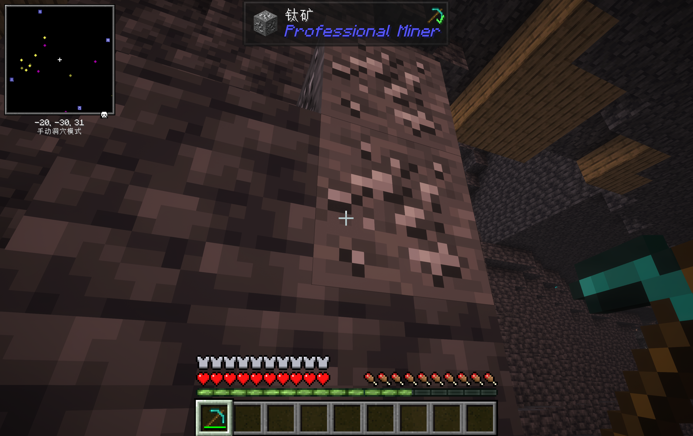

- **Generation Range**: Y = -50 ~ -15, uniform distribution
- **Vein Size**: Up to 8 blocks per vein, 2 attempts per chunk
- **Mining Requirement**: Diamond Pickaxe or above
- **Drops**: Raw Titanium
- **No experience drops**
- **Variants**: Generates as Titanium Ore in stone and Deepslate Titanium Ore in deepslate

### Deepslate Titanium Ore

- The deepslate variant of Titanium Ore with higher hardness (4.5 vs 3.0), other properties remain the same

---

## Raw Titanium

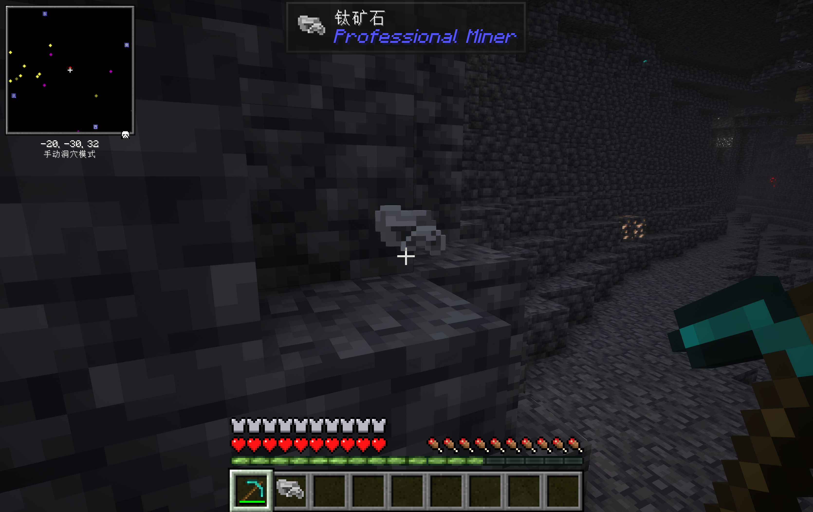

- Dropped from Titanium Ore / Deepslate Titanium Ore
- Can be smelted in a Furnace or Blast Furnace to obtain Titanium

| Smelting Method | Duration | Experience |
|---|---|---|
| Furnace | 200 ticks (10 seconds) | 0.7 |
| Blast Furnace | 100 ticks (5 seconds) | 0.7 |

---

## Titanium

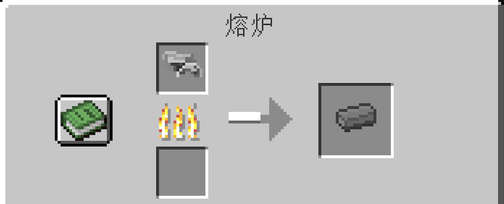

- Obtained by smelting Raw Titanium, a key material for crafting Titanium Alloy Ingot and Nether Titanium Alloy Ingot

---

## Alloy Smithing Template

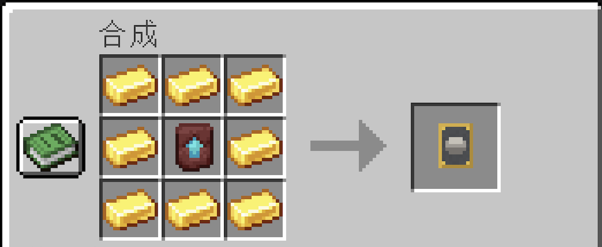

- Used in the Smithing Table for crafting Titanium Alloy Ingot, Nether Titanium Alloy Ingot, and Nether Titanium Alloy equipment

---

## Titanium Alloy Ingot

- **Crafting Method**: Smithing Table — Alloy Smithing Template + Iron Ingot + Titanium

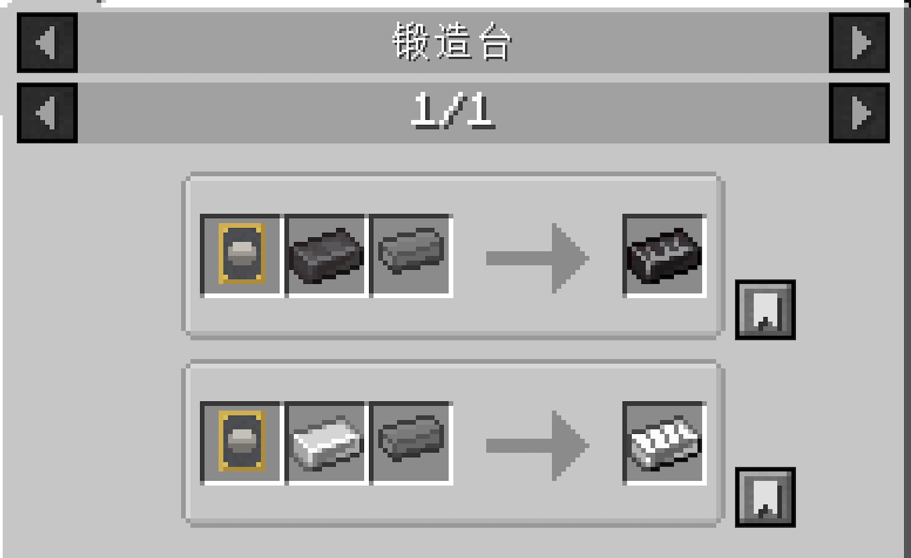

---

## Titanium Alloy Block

- **Crafting Recipe**: 9 Titanium Alloy Ingots (3×3)
- **Hardness**: 50.0, Blast Resistance 1200.0 (same as Netherite Block)
- **Mining Requirement**: Diamond Pickaxe or above

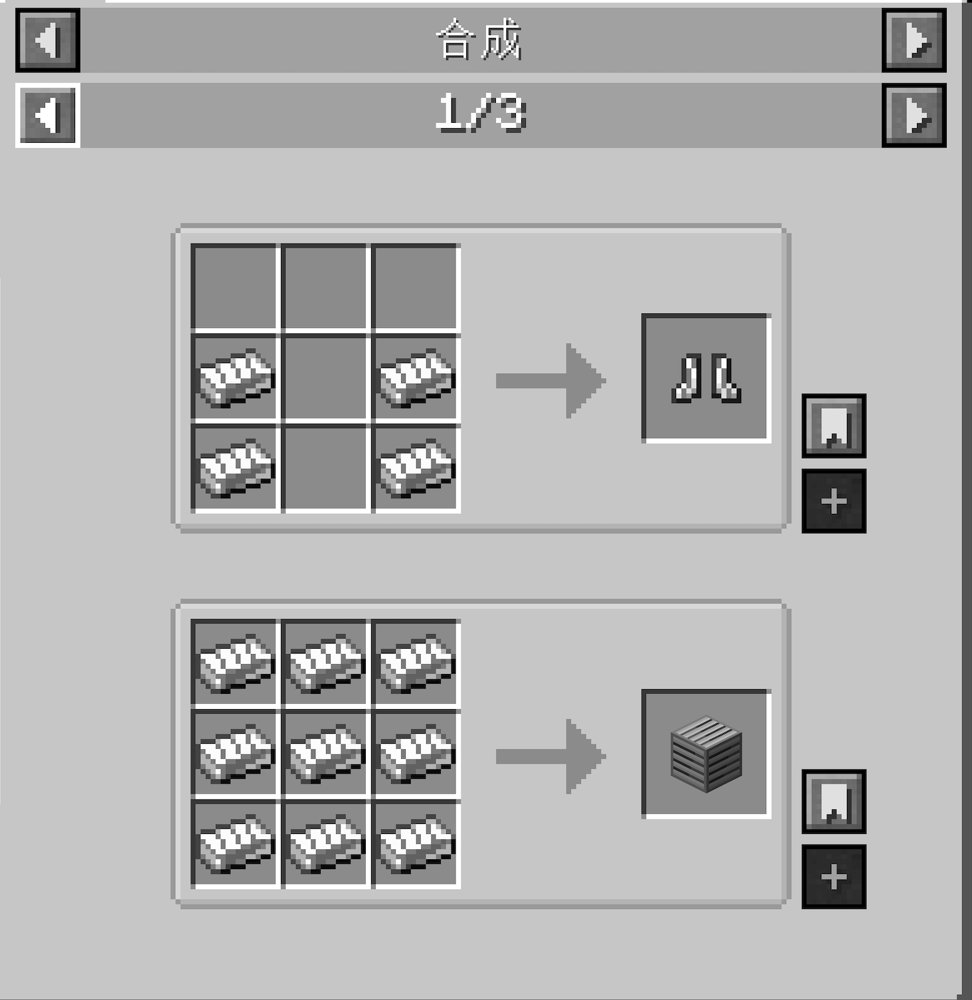

---

## Titanium Alloy Armor

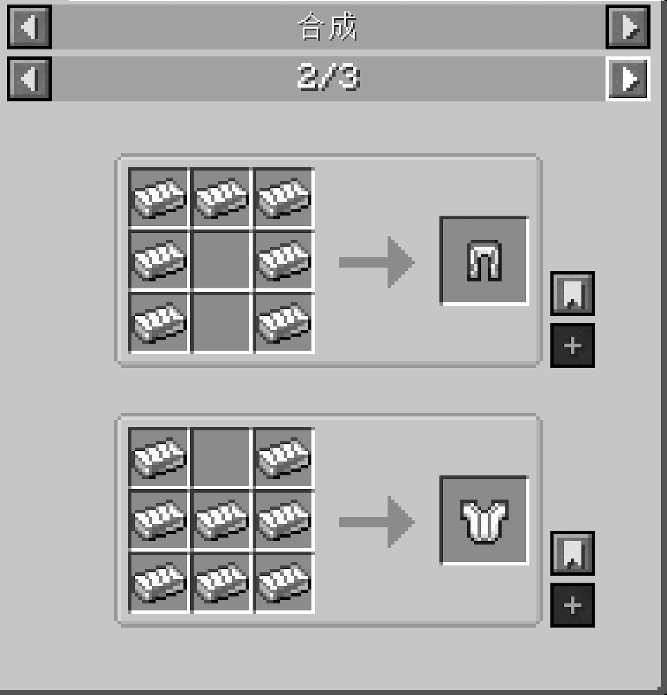

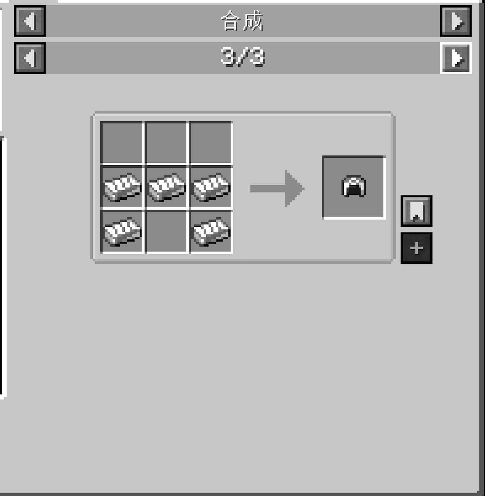

Crafted using Titanium Alloy Ingots with standard armor recipes at a Crafting Table.

| Equipment | Defense | Durability | Toughness | Knockback Resistance |
|---|---|---|---|---|
| Titanium Alloy Helmet | 2 | 1800 | 1.0 | 0.0 |
| Titanium Alloy Chestplate | 7 | 1800 | 1.0 | 0.0 |
| Titanium Alloy Leggings | 5 | 1800 | 1.0 | 0.0 |
| Titanium Alloy Boots | 2 | 1800 | 1.0 | 0.0 |

- **Enchantability**: 15
- **Repair Material**: Titanium Alloy Ingot

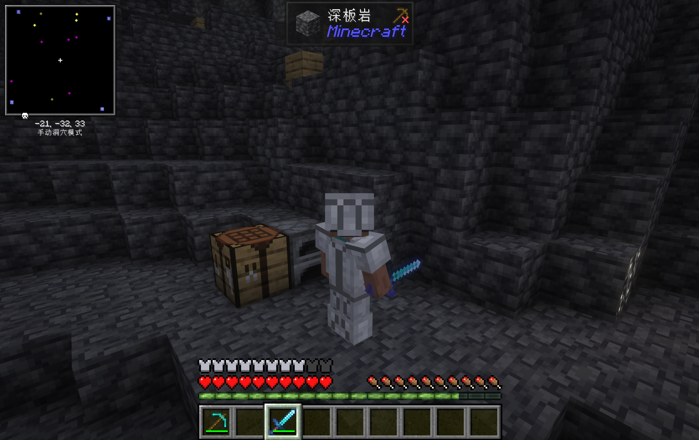

---

## Nether Titanium Alloy Ingot

- **Crafting Method**: Smithing Table — Alloy Smithing Template + Netherite Ingot + Titanium

---

## Nether Titanium Alloy Block

- **Crafting Recipe**: 9 Nether Titanium Alloy Ingots (3×3)
- **Hardness**: 50.0, Blast Resistance 1200.0 (same as Obsidian)
- **Mining Requirement**: Diamond Pickaxe or above

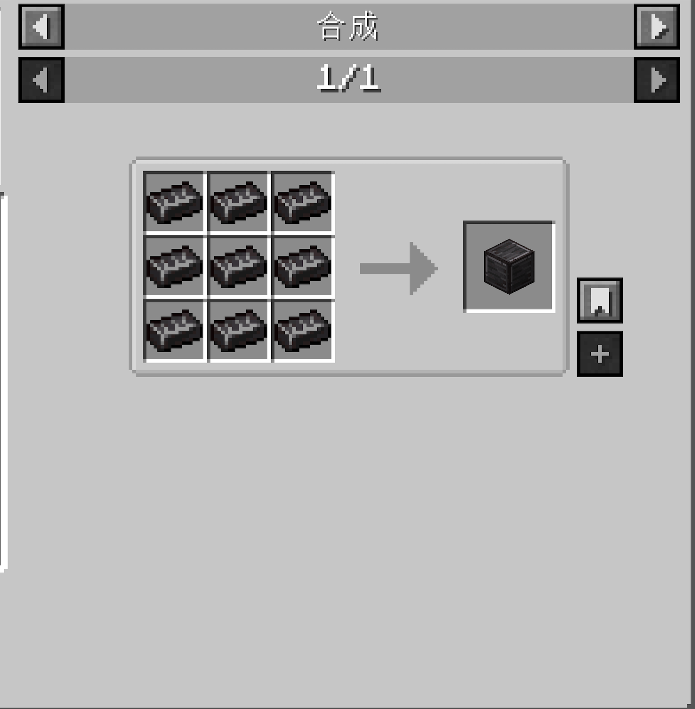

---

## Nether Titanium Alloy Armor

Crafted at a Smithing Table using Alloy Smithing Template + Diamond Armor + Nether Titanium Alloy Ingot.

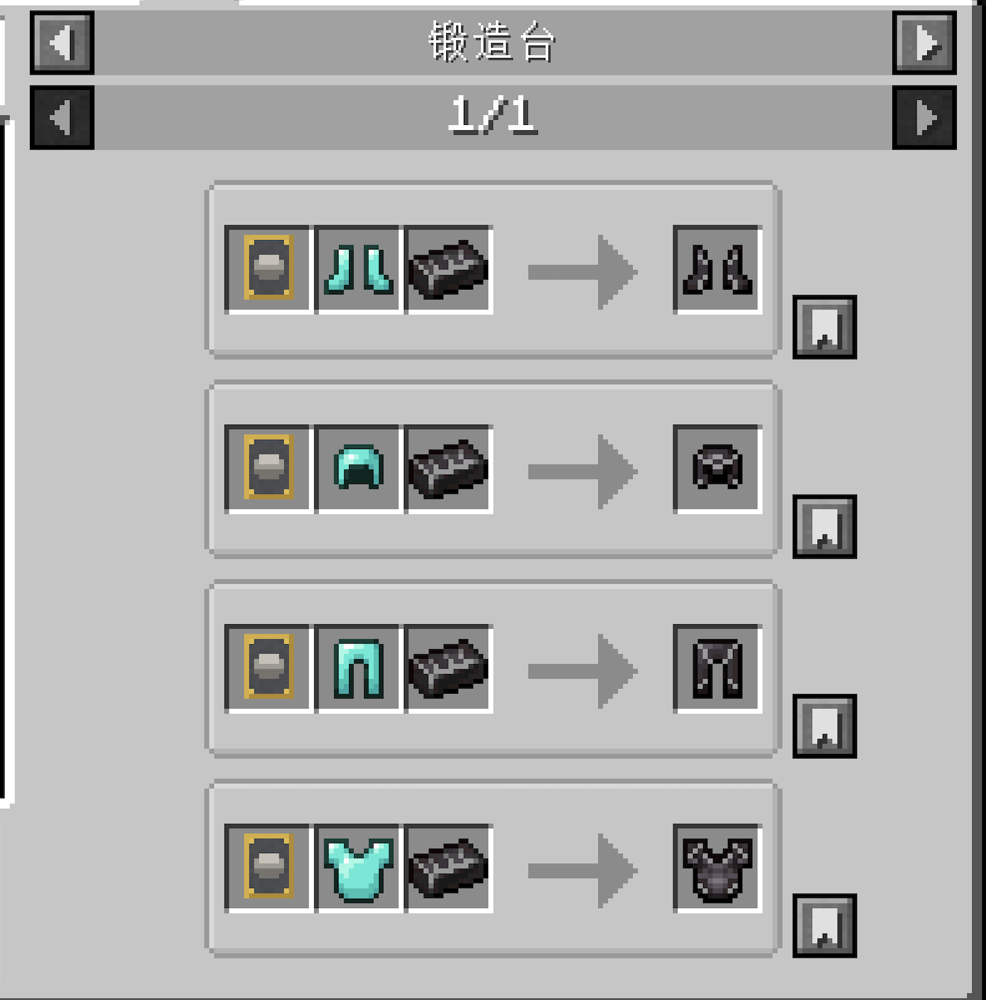

| Equipment | Defense | Durability | Toughness | Knockback Resistance |
|---|---|---|---|---|
| Nether Titanium Alloy Helmet | 4 | 3000 | 3.0 | 1.0 |
| Nether Titanium Alloy Chestplate | 8 | 3000 | 3.0 | 1.0 |
| Nether Titanium Alloy Leggings | 6 | 3000 | 3.0 | 1.0 |
| Nether Titanium Alloy Boots | 4 | 3000 | 3.0 | 1.0 |

- **Enchantability**: 20
- **Repair Material**: Nether Titanium Alloy Ingot
- **Fire Resistant**: All Nether Titanium Alloy armor pieces are fire resistant and will not be destroyed by lava

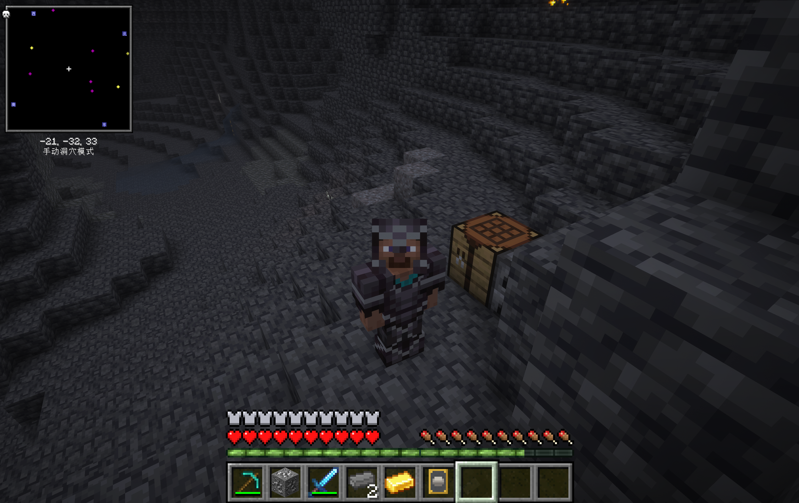

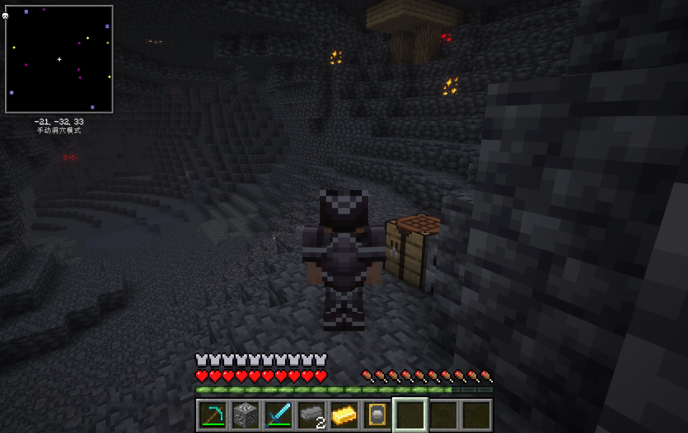
